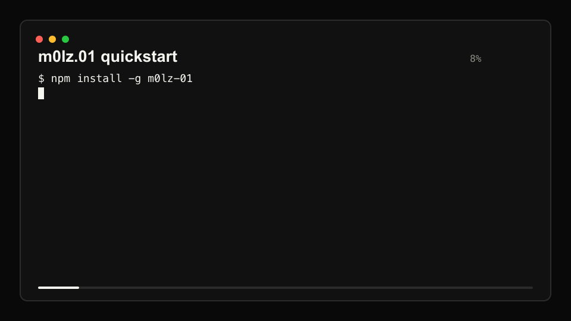
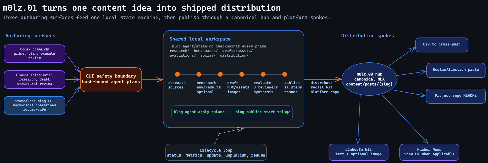

<p align="center">
  
</p>

<h1 align="center">m0lz.01</h1>

<p align="center">
  <strong>Idea-to-distribution pipeline for technical content</strong><br>
  Research, benchmark, draft, evaluate, publish, and distribute — all from one prompt.
</p>

<p align="center">
  <a href="https://github.com/jmolz/m0lz.01/actions/workflows/ci.yml"></a>
  &nbsp;
  <a href="https://www.npmjs.com/package/m0lz-01"></a>
  &nbsp;
  <a href="https://www.npmjs.com/package/m0lz-01"></a>
  &nbsp;
  <a href="./LICENSE"></a>
</p>

<p align="center">
  
</p>

---

## Overview

m0lz.01 orchestrates the full lifecycle of technical content. A single prompt can trigger deep research, scaffold a benchmark test suite, run it, draft an MDX post with the original data, adversarially evaluate the result against three reviewers, and distribute across platforms.

Content goes to a hub site (canonical URL, your choice of domain) with Dev.to (cross-post), Medium/Substack (paste-ready fallback), GitHub (companion repos), LinkedIn, and Hacker News as spokes.

Runs locally. No server, no SaaS. The mechanical pipeline is the standalone `blog` CLI; AI-heavy authoring can run from Claude Code or Codex, with Codex also serving the adversarial and methodology reviewer roles.

<p align="center">
  
</p>

---

## Prerequisites

### Required

- **Node.js ≥ 20.3** — required by the local `sharp` image pipeline and packaging checks. Check: `node --version`.
- **git** — publish/update/unpublish steps invoke git directly.
- **GitHub CLI (`gh`)** — PR creation, companion-repo scaffolding, release verification. Install from [cli.github.com](https://cli.github.com/). Run `gh auth login` once before first publish.
- **A hub site repo** — somewhere on GitHub to commit canonical MDX. Must have a posts directory (default `content/posts/`) and optionally a research directory (default `content/research/`). See [Configuration](#configuration) for the full shape.

### Optional — required for AI-heavy authoring/review

- **OpenAI Codex CLI** (`codex`) — Codex-first local authoring surface in this repo via `.codex/commands/*` wrappers and `.agents/skills/source-command-*`; also used as the adversarial + methodology reviewer (GPT-5.5 high / xhigh).
- **Claude Code** (`claude` CLI) — supported authoring surface via the packaged `.claude-plugin/` `/blog` skill and used as the structural reviewer. Falls back to `ANTHROPIC_API_KEY` if not installed for supported paths.

Both CLIs authenticate against your subscription. The npm package currently ships the Claude Code plugin; Codex support is repo-local command and skill guidance plus the standalone CLI.

### Accounts you'll need

| Service | Purpose | How to get credentials |
|---------|---------|----------------------|
| GitHub | Hub site, companion project repos, releases | `gh auth login` |
| Dev.to | Cross-post target | API key from [dev.to/settings/extensions](https://dev.to/settings/extensions) → `.env` |
| Medium / Substack | Paste-ready fallback (manual publish) | Account only — no API keys |
| LinkedIn / Hacker News | Social distribution (manual paste) | Account only |

---

## Install

```bash
npm install -g m0lz-01
blog --help    # verify installation
```

---

## Quick Start

Start here even if you know the commands. The first thing to understand is that `blog` is not an autonomous writer.

`blog` is the local state machine. It creates the SQLite row, writes template files, tracks which phase a post is in, validates required artifacts, and runs publish operations.

Codex, Claude Code, or a human author do the judgment work. That means inspecting a repo, running tests, researching sources, writing prose, filling the research template, interpreting benchmark results, and deciding what to publish.

Keep these names separate:

- **Workspace**: the folder that contains `.blog-agent/`, `.blogrc.yaml`, and `.env`.
- **Slug**: the permanent post ID, such as `m0lz-02-stack-loops`.
- **Source URL**: evidence for the post, such as `https://github.com/jmolz/m0lz.02.git`. A URL is not a slug.

### 1. Install the CLI

```bash
npm install -g m0lz-01
blog --help    # verify installation
```

### 2. Scaffold a workspace

`blog init` creates `.blog-agent/` (SQLite state + pipeline artifacts) in the current directory. Pick a dedicated location — **not** inside a project repo:

```bash
mkdir -p ~/blog && cd ~/blog
blog init
```

Edit `~/blog/.blogrc.yaml` (site repo + author details) and `~/blog/.env` (DEVTO_API_KEY, etc.) — see [Configuration](#configuration).

If you already have a workspace, do not run `blog init` again. Go to that folder before running commands:

```bash
cd ~/blog
blog status
```

From any other directory, pass the workspace explicitly:

```bash
blog --workspace ~/blog status
```

### 3. Pick an authoring surface

Codex can drive the repo-local command wrappers when you are working from this repository:

```text
.codex/commands/prime.md
.codex/commands/plan-feature.md <topic>
.codex/commands/execute.md <plan-file>
```

For Claude Code, load the packaged `/blog` plugin:

```bash
# npm-bundled install — plugin ships inside the tarball at .claude-plugin/
claude --plugin-dir "$(npm root -g)/m0lz-01/.claude-plugin"
```

Other install paths (repo clone, contributor symlink) in [`docs/plugin-install.md`](docs/plugin-install.md).

### 4. Use the authoring layer

Ask the authoring layer to do the thinking and writing, then let it call the CLI for state changes:

```
/blog In workspace ~/blog, create a project-launch post for m0lz.02 Stack Loops. Use https://github.com/jmolz/m0lz.02.git as the primary source, run the relevant tests, fill the research doc, draft the launch post, evaluate it, and prepare the distribution kit.
```

The authoring layer classifies intent, proposes a concrete plan, asks you to approve it, then hands off to `blog agent apply`, which runs each step under a SHA256-bound approval gate. All destructive work is CLI-native; Codex and Claude are orchestration surfaces over the same state.

Read [`docs/plugin-install.md`](docs/plugin-install.md) for troubleshooting.

---

## Using the CLI underneath

The direct CLI exposes the same state machine and publishing controls that `/blog` uses. It does not replace the authoring layer. Commands such as `research init` and `draft init` create records and templates; a human, Codex, or Claude still has to fill them.

### 1. Choose a work directory

`blog init` creates `.blog-agent/` (SQLite state + pipeline artifacts) in the current directory. Pick a dedicated location — **not** inside a project repo:

```bash
mkdir -p ~/blog && cd ~/blog
```

### 2. Scaffold the workspace

```bash
blog init
```

This creates three things in `~/blog/`:

- `.blogrc.yaml` — config template (edit next)
- `.env` — secrets template (edit next)
- `.blog-agent/` — SQLite state + subdirs for each phase

### 3. Edit `.blogrc.yaml`

At minimum, set `site.repo_path` and `author`:

```yaml
site:
  repo_path: "../code/m0lz.00"        # ← relative to THIS file, not CWD
  base_url: "https://your-domain.dev" # canonical URL root for all posts
  content_dir: "content/posts"        # posts location within the hub repo
  research_dir: "content/research"    # research companion pages

author:
  name: "Your Name"
  github: "your-gh-handle"
  devto: "your-devto-handle"
  # medium, substack, linkedin as applicable
```

**Watch out:** `repo_path` is resolved relative to `.blogrc.yaml`, not CWD. From `~/blog/.blogrc.yaml`, the path `../code/m0lz.00` correctly resolves to `~/code/m0lz.00`.

Full schema reference in [Configuration](#configuration).

### 4. Fill in `.env`

```env
DEVTO_API_KEY=             # required only if publish.devto = true
ANTHROPIC_API_KEY=         # optional — Claude API fallback when Claude Code unavailable
```

`.env` is gitignored by default.

### 5. Import existing posts (optional)

If your hub repo already has posts, ingest them into state:

```bash
blog init --import
```

Expected output: `Imported N posts from <hub-repo-name>`. Verify:

```bash
blog status
```

### 6. Create your first new post

Start with a slug. Do not pass the GitHub URL as the first argument.

```bash
# Correct: first argument is the slug
blog research init m0lz-02-stack-loops \
  --topic "m0lz.02 Stack Loops launch and testing write-up" \
  --content-type project-launch \
  --project m0lz.02

# Then record the repo as a source
blog research add-source m0lz-02-stack-loops \
  --url "https://github.com/jmolz/m0lz.02.git" \
  --type primary \
  --title "m0lz.02 repository"

blog research show m0lz-02-stack-loops
```

If `blog research show` prints something like `doc status: 7 empty`, the command worked. It means the CLI created the research template and is waiting for authored content.

At this point, switch to Codex or Claude Code if you want AI help doing the research and writing. Use a prompt like this:

```text
In workspace ~/blog, continue m0lz-02-stack-loops.
Inspect https://github.com/jmolz/m0lz.02.git as the primary source.
Run the relevant tests for the project.
Fill every empty section in /Users/jacobmolz/blog/.blog-agent/research/m0lz-02-stack-loops.md.
Then run blog research show m0lz-02-stack-loops.
Do not run blog research finalize m0lz-02-stack-loops until doc status is ok.
```

If you are working manually instead, fill the sections in the research document printed by `blog research show`, or write sections through the CLI:

```bash
blog research set-section m0lz-02-stack-loops --section thesis --from-file thesis.md
blog research set-section m0lz-02-stack-loops --section findings --from-file findings.md
```

When `blog research show` reports the document is complete, validate the phase:

```bash
blog research finalize m0lz-02-stack-loops
```

If finalize prints `Only 1 sources (min 3 required)`, the research doc may still be incomplete, but the CLI stopped earlier at the source-count gate. Add distinct sources until the count reaches the configured minimum. The default minimum is `evaluation.min_sources: 3` in `~/blog/.blogrc.yaml`.

For this example:

```bash
blog research add-source m0lz-02-stack-loops \
  --url "https://github.com/jmolz/m0lz.02/blob/main/README.md" \
  --type primary \
  --title "m0lz.02 README"

blog research add-source m0lz-02-stack-loops \
  --url "https://github.com/jmolz/m0lz.02/blob/main/docs/releases/UNRELEASED.md" \
  --type primary \
  --title "m0lz.02 release notes"

blog research show m0lz-02-stack-loops
```

If `blog research show` still reports empty or missing sections, finish the research document before retrying finalize. If it reports `doc status: ok` and `sources` is at least the configured minimum, retry:

```bash
blog research finalize m0lz-02-stack-loops
```

`research finalize` validates the research artifact. It does not draft the post and it does not advance to the next phase. To move on, choose the benchmark path:

```bash
# For optional benchmarking, run a benchmark cycle.
# This advances research -> benchmark.
blog benchmark init m0lz-02-stack-loops

# Or skip benchmarking when the content type allows it.
# This advances research -> draft.
blog benchmark skip m0lz-02-stack-loops
```

If you ran `blog benchmark init`, the post is now in the `benchmark` phase. Draft and evaluate commands will reject it until you complete the benchmark phase. Continue with:

```bash
blog benchmark env m0lz-02-stack-loops

# Run the real benchmark/test commands from the benchmark targets yourself.
# `benchmark run` only imports the JSON evidence file; it does not execute
# the target commands for you. Save a BenchmarkResults JSON file, then import it:
blog benchmark run m0lz-02-stack-loops --results-file path/to/results.json

blog benchmark show m0lz-02-stack-loops
blog benchmark complete m0lz-02-stack-loops
```

The operator-supplied results JSON shape is:

```json
{
  "slug": "m0lz-02-stack-loops",
  "timestamp": "2026-05-15T00:00:00.000Z",
  "targets": ["what you ran"],
  "data": {
    "summary": "what passed, failed, or changed"
  }
}
```

Do not pass `.blog-agent/benchmarks/<slug>/environment.json` to `--results-file`. That file only captures machine metadata. `--results-file` must point to benchmark results with the exact shape above; the CLI rejects environment snapshots and slug mismatches. Operator files do not need `run_id`; canonical `.blog-agent/benchmarks/<slug>/results.json` gets the authoritative DB run id when the CLI imports it.

`blog benchmark skip` only works before `blog benchmark init`, while the post is still in `research`. Treat `project-launch` as "benchmark optional" only when the launch claim truly does not depend on fresh measurements. If the post is making performance, fixture, release, or validation claims, run the target commands and import real results.

If an optional project-launch benchmark was started and the wrong file was imported, use the explicit repair path instead of editing SQLite:

```bash
# Replace bad canonical results with a valid result file. Requires an existing environment.json.
# A successful results-file repair restores the post to benchmark-backed state.
blog benchmark repair m0lz-02-stack-loops --results-file path/to/results.json

# Or skip a failed optional benchmark attempt, preserving raw benchmark artifacts.
# Use this only when the post will not make benchmark claims.
blog benchmark repair m0lz-02-stack-loops \
  --skip-optional \
  --reason "Optional project-launch benchmark attempt imported environment.json by mistake"
```

`--skip-optional` works only for optional benchmark content in `benchmark` or `draft`, refuses existing draft MDX that may contain stale benchmark prose, writes `.blog-agent/benchmarks/<slug>/repair.json`, and advances `benchmark -> draft` when needed.

Then continue through draft, evaluate, and publish:

```bash
blog draft init m0lz-02-stack-loops
blog draft platform-images m0lz-02-stack-loops
blog draft show m0lz-02-stack-loops
blog draft validate m0lz-02-stack-loops
blog draft complete m0lz-02-stack-loops

blog evaluate init m0lz-02-stack-loops
blog evaluate structural-autocheck m0lz-02-stack-loops
# If structural-autocheck reports generated-draft issues, regenerate the draft
# from research + benchmark artifacts, then rerun autocheck before reviewer JSON.
blog draft regenerate m0lz-02-stack-loops
blog evaluate structural-autocheck m0lz-02-stack-loops
# Once autocheck is clean, record reviewer JSON, synthesize, then complete.

blog publish start m0lz-02-stack-loops --image-mode generate
```

For normal draft reviews, `blog evaluate structural-autocheck` only runs after
`blog evaluate init` has moved the post into the `evaluate` phase. For update
reviews, `blog update evaluate` opens an `is_update_cycle` manifest while the
post remains `published`; autocheck accepts only that manifest-gated published
state.

See [CLI Reference](#cli-reference) below for every subcommand.

---

## Configuration

### `.blogrc.yaml`

Lives alongside `.blog-agent/`. All path fields resolve **relative to this file**, not CWD.

| Section | Required fields | Purpose |
|---------|----------------|---------|
| `site` | `repo_path`, `base_url`, `content_dir` | Hub site repo location + canonical URL |
| `author` | `name`, `github` | Frontmatter, repo URLs, social handles |
| `ai` | — | Reviewer panel assignment (Claude / Codex) |
| `content_types` | (3 type keys) | Per-content-type pipeline behavior |
| `benchmark` | — | Environment capture, methodology template, run count |
| `publish` | — | Per-platform crossposting toggles |
| `evaluation` | — | Reviewer panel thresholds + policies |
| `updates`, `unpublish` | — | Lifecycle flow options |
| `projects` (optional) | map | Catalog-ID → companion project repo path |

**Content types:**

| Type | Benchmark | Companion repo | HN prefix |
|------|-----------|---------------|-----------|
| `technical-deep-dive` | required | scaffold new | (none) |
| `project-launch` | optional | link existing | `Show HN:` |
| `analysis-opinion` | skip | optional | (none) |

Full annotated defaults ship in `.blogrc.example.yaml`. Minimum viable config:

```yaml
site:
  repo_path: "../your-hub-repo"
  base_url: "https://your-domain.dev"
  content_dir: "content/posts"

author:
  name: "Your Name"
  github: "your-gh-handle"
```

### `.env`

| Variable | Required | Purpose |
|----------|----------|---------|
| `DEVTO_API_KEY` | if `publish.devto: true` | Dev.to Forem API auth |
| `ANTHROPIC_API_KEY` | no | Claude API fallback when Claude Code CLI isn't used |

`.env` is loaded via `dotenv` from the directory where you run `blog`. Keep it in your work directory (same place as `.blogrc.yaml`).

---

## CLI Reference

```bash
# Workspace
blog init                                  # create .blog-agent/ + templates
blog init --import                         # also import existing posts from hub
blog status                                # table of all posts + phase
blog --workspace ~/blog status             # run against an existing workspace from anywhere
blog metrics                               # aggregate stats

# Editorial backlog
blog ideas                                 # list ideas.yaml
blog ideas add "title" --priority high --type technical-deep-dive
blog ideas start <index>                   # promote to research phase

# Research phase
blog research init <slug> --topic "..."    # create DB row + research template; does not research
blog research add-source <slug> --url "..." # track a source URL; does not fetch or analyze it
blog research show <slug>                  # print doc path + empty/missing section count
blog research set-section <slug> --section thesis --from-file thesis.md
blog research finalize <slug>              # validate filled doc; does not advance phase

# Benchmark phase
blog benchmark init <slug>                 # advance research -> benchmark
blog benchmark env <slug>                       # capture environment
blog benchmark run <slug> --results-file <file> # import BenchmarkResults JSON, not environment.json
blog benchmark show <slug>
blog benchmark skip <slug>                      # skip/optional content only; research -> draft
blog benchmark complete <slug>                  # requires imported results, then → draft phase
blog benchmark repair <slug> --results-file <file>
blog benchmark repair <slug> --skip-optional --reason "..."

# Draft phase
blog draft init <slug>
blog draft show <slug>
blog draft validate <slug>
blog draft add-asset <slug> --path <file> --type excalidraw|chart|image
blog draft platform-images <slug>              # generate Dev.to/Medium/Substack PNG assets
blog draft regenerate <slug>                   # rebuild generated body pre-publish
blog draft regenerate-frontmatter <slug> [--project <id>]
blog draft complete <slug>                      # → evaluate phase

# Evaluate phase (three-reviewer adversarial panel)
blog evaluate init <slug>
blog evaluate structural-autocheck <slug>       # deterministic lints
blog evaluate record <slug> --reviewer <id> --file <reviewer.json>
blog evaluate show <slug>
blog evaluate synthesize <slug>                 # consensus/majority/single
blog evaluate complete <slug>                   # → publish phase
blog evaluate reject <slug>                     # → draft phase

# Publish phase (11-step resumable pipeline)
blog publish start <slug> [--image-mode off|local-card|prompt-only|generate|required]
blog publish show <slug>                        # per-step status table
blog publish reopen-draft <slug> --reason "..." # repair pre-site-pr draft defects
blog publish platform-images <slug> [--commit-site]
blog publish distribution-kit <slug> \
  [--commit-site] [--image-mode off|local-card|prompt-only|generate|required] [--force]

# Update an already-published post
blog update start <slug> --summary "what changed"
blog update benchmark <slug> --results <file>
blog update draft <slug>
blog update evaluate <slug>
blog evaluate structural-autocheck <slug>       # manifest-gated while published
blog update publish <slug>
blog update show <slug>
blog update abort <slug>

# Unpublish
blog unpublish start <slug> --confirm
blog unpublish show <slug>

# Agent orchestration (used by the /blog skill; also usable directly)
blog agent preflight [--json]                   # workspace + config + schema snapshot
blog agent plan <slug> \
  --intent "..." --content-type <type> --depth <depth> --venues "v1,v2" \
  [--steps-inline '<json>' | --steps-json <path>] \
  [--output <path-inside-.blog-agent/plans/>]    # write an unapproved plan skeleton
blog agent approve <plan-path>                  # atomic approved_at + payload_hash
blog agent verify  <plan-path>                  # dry-run validate an approved plan
blog agent apply   <plan-path> [--restart]      # execute step-by-step, writes receipt
```

The `agent` family is the skill's handoff surface: `plan` writes an unapproved
plan file, `approve` hash-binds it, `verify` dry-runs the validator, and `apply`
executes each step under the SHA256-bound gate. The apply runner refuses to run
an unapproved plan, a re-approved plan (hash mismatch), a plan from a different
workspace, or a plan whose step list tries to nest `blog agent *` calls.

`blog draft platform-images` writes deterministic local distribution images to
`.blog-agent/drafts/<slug>/assets/`: `devto-cover.png` (`1000x420`),
`medium-featured.png` (`1200x675`), and `substack-preview.png` (`1200x630`).
All three use the same article-card framework with platform-specific
dimensions. The command updates draft frontmatter with `devto_main_image`,
`medium_featured_image`, and `substack_preview_image`; later `site-pr` /
`site-update` verifies those fields without rewriting the evaluated draft.
`blog draft complete` requires those fields, so a post cannot reach
evaluation/publish with missing platform-image frontmatter. The command also
writes `.platform-images.json` with an input hash over the title, project label,
host, template version, and platform dimensions. Publish rejects generator-owned
image paths when that receipt is missing, stale, or points at different bytes.

Initial `site-pr` writes the hub-site copy with `published: true` so the
Vercel preview renders the post on `/writing` and at `/writing/<slug>` while
the source draft remains unchanged in `.blog-agent/drafts/<slug>/index.mdx`.
Update-mode site PRs copy the update draft verbatim. Generated research
companion pages include `project`, `author`, and `sections` frontmatter so the
hub research index and post research panel render the same structure as
hand-authored research pages.

`blog publish start` and `blog update publish` also generate a durable
publication bundle before the site repo is mutated. Local artifacts land in
`.blog-agent/social/<slug>/`: `linkedin.md`, `hackernews.md`,
`medium-paste.md`, `medium-upload-checklist.md`, `substack-paste.md`,
`substack-upload-checklist.md`, and `manifest.json`. `linkedin.md` and
`hackernews.md` are public posting copy only; operator prompts and upload
checklists live in separate artifacts. `linkedin-image-prompt.md` is written
only for `prompt-only`, `generate`, and `required` image modes. The default
LinkedIn feed image is a deterministic local card at the fixed PNG path
`.blog-agent/social/<slug>/assets/linkedin-feed.png`. Medium/Substack paste
rendering also converts Markdown pipe tables outside fenced code into stable PNG
assets at `.blog-agent/social/<slug>/assets/portable-table-<hash>.png`. The
canonical MDX remains unchanged and stays semantic. Medium and Substack receive
local upload/checklist guidance for generated tables instead of depending on
arbitrary public PNG URLs as editor embeds.

The site PR/update PR carries the complete reviewed bundle:

```text
content/posts/<slug>/
  index.mdx
  assets/
    devto-cover.png
    medium-featured.png
    substack-preview.png
    linkedin-feed.png
    portable-table-<hash>.png
  distribution/
    linkedin.md
    hackernews.md
    medium-paste.md
    medium-upload-checklist.md
    substack-paste.md
    substack-upload-checklist.md
    linkedin-image-prompt.md # only for prompt-only/generate/required
    manifest.json
```

The `social-text` pipeline step revalidates the local bundle before site
persistence. A valid generated-image manifest is reused without a provider call,
but deterministic text, paste files, prompts, checklists, and local-card images
are compared against freshly rendered expected hashes so a self-referential
manifest edit cannot be copied forward. The paste steps load the manifest files
rather than regenerating from post-preview content.

Medium and Substack paste files are generated from the same evaluated MDX, but
with platform-specific copy constraints. Medium table handoff recommends
importing the canonical URL first, then uploading local generated table PNGs
when import or manual paste loses table fidelity. Substack receives local
upload/drag-drop table guidance because the post editor is not a durable
Markdown-table or custom-HTML target. Substack subtitles are fit naturally from
`description` or fail before site checkout/copy/commit; they are not hard-clipped
with ellipses. Hacker News first-comment descriptions use the same no-hard-
ellipsis fitter. Image-backed MDX
visual components, such as chart or figure components with
`src="./assets/<file>"`, are converted to public Markdown image links before JSX
is stripped so the visual remains copyable into Medium and Substack. Data-only
interactive charts still need an exported image asset before publish.

LinkedIn image generation is controlled by `.blogrc.yaml`:

```yaml
social:
  distribution_kit:
    enabled: true
    persist_to_site: true
    directory: "distribution"
  linkedin_image:
    mode: "local-card" # off | local-card | prompt-only | generate | required
    model: "gpt-image-2-2026-04-21"
    size: "1200x1200"
    quality: "high"
```

`local-card` is the default and writes `assets/linkedin-feed.png` without
calling OpenAI. `prompt-only` is explicit compatibility mode: it writes
`linkedin-image-prompt.md` and no feed image. Pass
`blog publish start <slug> --image-mode generate` or `--image-mode required`
when the initial publish must use an OpenAI-backed LinkedIn PNG. Both modes use
`OPENAI_API_KEY` with GPT Image 2 and fail before site checkout/copy/commit if
image generation is unavailable. Use
`blog publish distribution-kit <slug> --image-mode generate --force --commit-site`
to backfill a published post's LinkedIn image, or
`blog publish distribution-kit <slug> --image-mode prompt-only` to backfill only
the paste-ready files without an image API call.

For a published post whose Dev.to, Medium, or Substack header images were
generated from stale frontmatter, run:

```bash
blog publish platform-images <slug> --commit-site
```

That regenerates the three deterministic platform images from the current draft
frontmatter, refreshes `.platform-images.json`, and commits the changed PNGs to
the configured hub site repo.

---

## Troubleshooting

### `blog init --import` says "Posts directory not found"

`site.repo_path` resolved to the wrong location. Paths are relative to `.blogrc.yaml`, **not** CWD. Open the file and fix the path to what your hub repo actually lives at — then re-run.

### Publish pipeline stopped mid-run

Re-run `blog publish start <slug>` — the pipeline picks up at the first non-completed step. State lives in `.blog-agent/state.db` (`pipeline_steps` table). Every step is idempotent.

The first publish step re-checks the latest passed evaluation manifest,
synthesis receipt, and reviewed artifact hashes. If the draft, benchmark
results, environment snapshot, or structural autocheck output changed after
`blog evaluate complete`, publish fails before any site files are copied. Run:

```bash
blog publish reopen-draft <slug> --reason "evaluated artifact drift"
```

Then re-run draft completion, the reviewer panel, synthesis, and
`blog evaluate complete <slug>` before resuming `blog publish start <slug>`.

If the failed step is `site-pr` because the evaluated draft is missing
`devto_main_image`, `medium_featured_image`, or `substack_preview_image`, run:

```bash
blog publish reopen-draft <slug> --reason "missing platform images"
blog draft platform-images <slug>
blog draft complete <slug>
blog evaluate init <slug>
```

Then re-run the three reviewers, synthesize, complete evaluation, and resume
`blog publish start <slug>`. The reopen command only works for the pre-site-pr
platform-image failure and clears stale initial-publish step rows.

### "Lock held by PID N" on publish / update / unpublish

Another process is running, OR a previous run crashed without releasing the lock. Check `ps -p N` — if the PID is dead, remove `.blog-agent/locks/<slug>.lock` and retry. (The CLI reclaims stale `running` rows automatically on resume; only the lockfile may need manual cleanup after a hard crash.)

### Dev.to cross-post fails with 429 / 401

- 429 = rate-limited; wait and re-run `blog publish start <slug>` to retry just that step.
- 401 = `DEVTO_API_KEY` missing or invalid; verify at [dev.to/settings/extensions](https://dev.to/settings/extensions).

### `blog evaluate record` rejects reviewer file

Every reviewer output must conform to the `ReviewerOutput` schema: `reviewer`, `passed`, `issues[]`. Run `blog evaluate structural-autocheck <slug>` first to produce a valid example, then pattern-match.

### `git push` failures during publish

The pipeline runs `assertIndexClean` + strict ahead-commit match before any push. If this fails, an unrelated file in your hub / project repo has uncommitted changes. Clean the tree (commit, stash, or revert), then `blog publish start <slug>` to resume.

### Reset a post back to draft for rework

`blog evaluate reject <slug>` closes the current evaluation cycle and moves a
normal draft review back to `draft`; reject/re-init cycles are not update
reviews. Published update reviews stay `published`; continue or abort them
through the update flow.

---

## Architecture

Three-layer local workflow:

- **Standalone CLI** (what `npm install -g m0lz-01` gives you) — mechanical operations: state management, pipeline execution, git/GitHub/Dev.to API calls. No AI dependency.
- **Codex repo guidance** (`.codex/commands/*` + `.agents/skills/source-command-*`) — Codex-first planning, execution, review, and maintenance commands for local development.
- **Claude Code skills** (`.claude-plugin/`, shipped in the npm tarball) — interactive `/blog` work: research, drafting, structural review. Skills call the CLI for all state mutations.

Both layers share state via SQLite (`.blog-agent/state.db`) and file artifacts (`.blog-agent/`). Every publish/update/unpublish step is **idempotent** and **checkpointed** — failures resume from the last good step.

Three-reviewer adversarial evaluation:

| Reviewer | Model | Role |
|----------|-------|------|
| Structural | Claude Code | Content quality, MDX schema, sources |
| Adversarial | GPT-5.5 high (Codex) | Thesis challenge, bias, argument gaps |
| Methodology | GPT-5.5 xhigh (Codex) | Benchmark validity, statistics, reproducibility |

Issues categorize as consensus (all 3), majority (2/3), and single (1/3). By default, the completion gate requires a clean pass: any outstanding reviewer issue blocks `blog evaluate complete`. Set `evaluation.single_advisory: true` only if single-reviewer issues should be advisory.

Full product scope: `.claude/PRD.md`. Per-phase implementation plans: `.claude/plans/`.

---

## Development

Contribute or work from source:

```bash
git clone https://github.com/jmolz/m0lz.01.git
cd m0lz.01
npm install
npm run build
node dist/cli/index.js init --import
```

Validate:

```bash
npm run lint          # tsc --noEmit
npm test              # vitest run (new distribution-kit coverage included)
npm run build         # clean + tsc
npm run verify-pack   # four-layer packaging gate
```

Release workflow: [RELEASING.md](./RELEASING.md) — adversarially-reviewed runbook for `npm publish` + `gh release create`.

---

## Changelog

[CHANGELOG.md](./CHANGELOG.md).

## Project Status

v0.1 — public API is unstable until v1.0. Per [SemVer 0.y.z](https://semver.org/spec/v2.0.0.html#spec-item-4), minor and patch releases before 1.0 MAY contain breaking changes.

## License

MIT

## Writing

- [m0lz-01-launch](https://m0lz.dev/writing/m0lz-01-launch)
